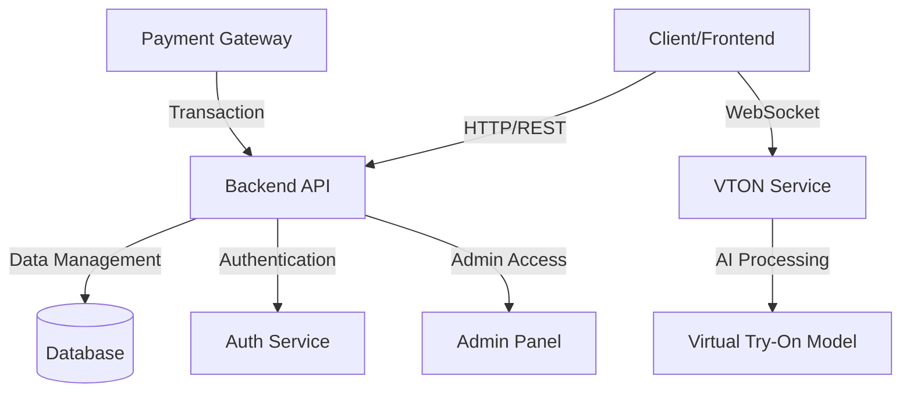

# Virtual Try-On E-Commerce Platform 🛍️

A cutting-edge e-commerce platform featuring AI-powered virtual try-on technology for clothing. This system allows users to virtually try on clothes before making a purchase, revolutionizing the online shopping experience.

## 🌟 Key Features

- 🤖 AI-Powered Virtual Try-On
- 👕 Real-time Clothing Visualization
- 🛒 Full E-commerce Functionality
- 👤 User Profile Management
- 🎯 Personalized Recommendations
- 📱 Responsive Design
- 🔐 Secure Authentication
- 💳 Payment Integration
- 📊 Admin Dashboard

## 🏗️ System Architecture



## 🤖 AI Architecture - Virtual Try-On Model


## 🔬 CP-VTON Model References

### Research Papers

1. **CP-VTON: Characteristic-Preserving Virtual Try-On Network**
   - Authors: Bochao Wang, Huabin Zheng, Xiaodan Liang, Yimin Chen, Liang Lin, Meng Yang
   - Published: ECCV 2018
   - DOI: [10.1007/978-3-030-01216-8_37](https://doi.org/10.1007/978-3-030-01216-8_37)
   - [Paper Link](https://arxiv.org/abs/1807.07688)

2. **CP-VTON+: Clothing Shape and Texture Preserving Image-Based Virtual Try-On**
   - Authors: Matiur Rahman Minar, Thai Thanh Tuan, Heejune Ahn, Paul Rosin, Yu-Kun Lai
   - Published: CVPRW 2020
   - [Paper Link](https://arxiv.org/abs/2004.07378)

### Key Components

1. **Geometric Matching Module (GMM)**
   - Predicts a Thin-Plate Spline (TPS) transformation
   - Warps the clothing item to align with the target person's pose
   - Preserves clothing characteristics during warping

2. **Try-on Module (TOM)**
   - Generates the final try-on result
   - Renders the warped clothing on the person
   - Handles occlusions and preserves details

### Model Architecture Details


### Dataset References

1. **VITON Dataset**
   - 19,000 image pairs
   - Front-view women images
   - Resolution: 256 x 192
   - [Dataset Link](https://vision.cs.ubc.ca/datasets/fashion/)

2. **MPV Dataset**
   - Multi-Pose Virtual Try-on
   - 35,687 person images
   - 13,524 clothing items
   - Multiple poses and views

### Implementation Details

Our implementation uses the following key improvements:

1. **Enhanced Pre-processing**
   - Human parsing using [Self-Correction Human Parsing](https://github.com/PeikeLi/Self-Correction-Human-Parsing)
   - Pose estimation using OpenPose
   - Cloth mask extraction using U2NET

2. **Model Enhancements**
   - Second-order difference constraint for TPS
   - Multi-stage refinement strategy
   - Improved loss functions:
     - VGG perceptual loss
     - Style loss
     - Content loss

3. **Training Configuration**
   - Batch size: 4
   - Learning rate: 0.0001
   - Optimizer: Adam
   - Epochs: 200

### Citation

```bibtex
@inproceedings{wang2018cp,
  title={Toward Characteristic-Preserving Image-based Virtual Try-On Network},
  author={Wang, Bochao and Zheng, Huabin and Liang, Xiaodan and Chen, Yimin and Lin, Liang and Yang, Meng},
  booktitle={ECCV},
  year={2018}
}

@inproceedings{minar2020cp,
  title={CP-VTON+: Clothing Shape and Texture Preserving Image-Based Virtual Try-On},
  author={Minar, Matiur Rahman and Tuan, Thai Thanh and Ahn, Heejune and Rosin, Paul and Lai, Yu-Kun},
  booktitle={The IEEE/CVF Conference on Computer Vision and Pattern Recognition (CVPR) Workshops},
  year={2020}
}
```

## 🚀 Getting Started

### Prerequisites

- Node.js (v14 or higher)
- Python 3.8+
- MongoDB
- GPU (recommended for VTON service)

### Installation Steps

1. **Clone the repository**
   ```bash
   git clone [repository-url]
   cd Clothes-VTON-E-Commerce-Platform
   ```

2. **Backend Setup**
   ```bash
   cd backend
   npm install
   npm start
   ```

3. **Frontend Setup**
   ```bash
   cd frontend
   npm install
   npm run dev
   ```

4. **Admin Panel Setup**
   ```bash
   cd admin_panel
   npm install
   npm start
   ```

5. **VTON Service Setup**
   ```bash
   cd clothes-vton-service
   pip install -r requirements.txt
   python app.py
   ```

## 🔧 Technology Stack

- **Frontend**: React.js, Vite, TailwindCSS
- **Backend**: Node.js, Express.js
- **Database**: MongoDB
- **AI Model**: PyTorch, TensorFlow
- **Authentication**: JWT
- **Real-time Communication**: WebSocket
- **Payment Processing**: Stripe

## 📸 Screenshots

[Place screenshots here]

### Home Page
![Home Page]

### Virtual Try-On Interface
![Try-On Interface]

### Product Catalog
![Product Catalog]

### Admin Dashboard
![Admin Dashboard]

## 🔐 Security Features

- JWT Authentication
- Secure Payment Processing
- Data Encryption
- CORS Protection
- Input Validation
- Rate Limiting

## 🎯 Future Enhancements

- [ ] Mobile App Development
- [ ] AR Integration
- [ ] Multi-language Support
- [ ] Advanced Analytics Dashboard
- [ ] AI-powered Size Recommendations
- [ ] Social Media Integration

## 📄 License

This project is licensed under the MIT License - see the [LICENSE](LICENSE) file for details.

## 👥 Contributors

- [Contributor 1]
- [Contributor 2]
- [Contributor 3]

## 📞 Support

For support, email [support@email.com] or join our Slack channel.

---

⭐ Don't forget to star this repository if you found it helpful! 